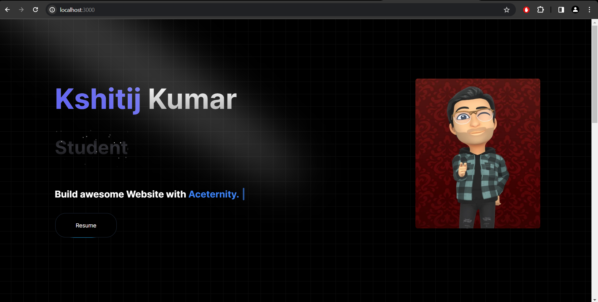

# Portfolio Website

This is a portfolio website built using Next.js, Tailwind CSS, and TypeScript.



## Table of Contents

- [Introduction](#introduction)
- [Features](#features)
- [Installation](#installation)
- [Usage](#usage)
- [Customization](#customization)
- [Deployment](#deployment)

## Introduction

This portfolio website serves as a showcase of my work, skills, and experience. It is built using modern web development technologies like Next.js, Tailwind CSS, and TypeScript to ensure a smooth and efficient development experience.

## Features

- **Responsive Design:** The website is fully responsive and optimized for various screen sizes, ensuring a seamless experience across devices.
- **Dynamic Routing:** Next.js enables dynamic routing, allowing easy navigation between different sections of the website.
- **Customizable:** The website is easily customizable, allowing you to update content, styles, and layouts according to your preferences.
- **SEO Friendly:** Next.js provides built-in SEO optimization features, ensuring better visibility and ranking on search engines.
- **Fast Loading:** Tailwind CSS and Next.js optimization techniques ensure fast loading times, enhancing user experience.

## Installation

To run the portfolio website locally, follow these steps:

1. **Clone the repository:**

   ```bash
   git clone https://github.com/kumarkshitij171/Portfolio-nextJs.git
   ```

2. **Install dependencies:**

   ```bash
   cd portfolio-website
   npm install
   ```

## Usage

Once the dependencies are installed, you can start the development server:

```bash
npm run dev
```

This will start the development server at [http://localhost:3000](http://localhost:3000). You can then view the website in your browser.

## Customization

You can customize various aspects of the website:

- **Content:** Update the content of the website by modifying the components in the `pages` directory.
- **Styles:** Tailwind CSS is used for styling, so you can easily customize styles by editing the `styles` directory and Tailwind configuration file.
- **Layout:** Modify the layout of the website by editing the components in the `components` directory.

## Deployment

To deploy the portfolio website, you can use platforms like Vercel, Netlify, or GitHub Pages. Follow the deployment instructions provided by the platform of your choice.

